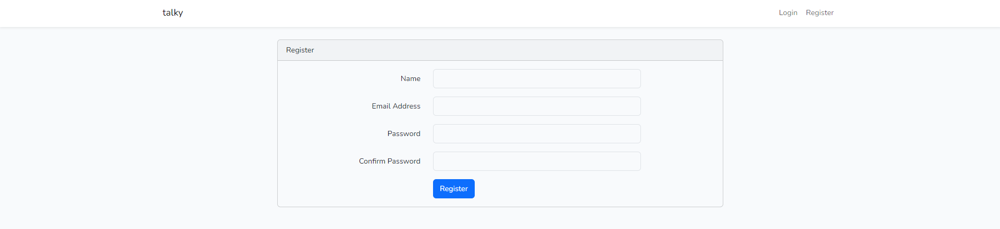

# PROJECT_SECURE_WEB_CHAT
This is a Project of Secure Web Coding Course at HUST

## Environment
* Ubuntu
* Nginx
* MySQL
* PHP:
    Modules: bcmath, calendar, Corectype, curl, date, dom, exif, FFI, fileinfo, filter, ftp, gd, gettext, hash, iconv, json, libxml, mbstring, mysqli, mysqlnd, openssl, pcntl, pcre, PDO, pdo_mysql, pdo_pgsql, pdo_sqlite, pgsql, Phar, posix, random, readline, Reflection, session, shmop, SimpleXML, sockets, sodium, SPL, sqlite3, standard, sysvmsg, sysvsem,  sysvshm, tokenizer, xml, xmlreader, xmlwriter, xsl, Zend OPcache, zip, zlib
* Redis
* Laravel:
    * laravel/ui
    * predis/redis
* JS Framework:
    * NodeJS
    * VueJS
    * Bootstrap
    * ...
* WebSockets: Socket.IO
* ................
* Setup environment: [LEMP Stack](https://www.digitalocean.com/community/tutorials/how-to-install-linux-nginx-mysql-php-lemp-stack-on-ubuntu-20-04), [Laravel Framework](https://laravel.com/docs/11.x/deployment)

## Architectures:
### Webserver
* Nginx                           

* Laravel request lifecycle

* Application Flow

## Implementation:
* Authentication:
    * Login page

    * Register page

    * Reset password page

    * Dashboard page

## Secure rubrics:
### Managing and Authenticating Password:
* Password policy: using [Laravel Password Validation Rule](https://laravel.com/api/8.x/Illuminate/Validation/Rules/Password.html)
    * Min length: 8
    * Required at least one one number, one symbol, one lowercase and uppercase letter
    * Required uncompromised password

* Secure password storage: using [MySQL](http://www.mysql.com)
    * Password stored in local Database

* Prevent bruteforce password: using [Laravel Rate Limiter](https://laravel.com/api/8.x/Illuminate/Support/Facades/RateLimiter.html)
    * Limit number of requests per minute by an IP
    * Limit number of requests perminute at each input
    * Limit number of requests per minute at an endpoint

* Restoring Password and Update Password features

### Authenticating and Managing Session:
* Có cơ chế an toàn khi sử dụng access token để xác thực phiên: chống giả mạo, can thiệp, vét cạn
* Có cơ chế kiểm soát thời gian của phiên
* Có cơ chế chống tấn công  CSRF
* Bảo vệ cookie, chống session hijacking

### Authorization:
* Phân quyền và kiểm duyệt truy cập theo chức năng, nghiệp vụ
* Chống leo thang đặc quyền

### Handle untrusted data (input):
* Kiểm duyệt và làm sạch giá trị đầu vào
* Chống các dạng tấn công Injection
* Chống các dạng tấn công duyệt file, thư mục trái phép
* Kiểm soát file do người dùng upload

### Logging and Reporting:
* Ghi đầy đủ thông tin sự kiện xảy ra trên ứng dụng.
* Kiểm soát nội dung thông báo lỗi, không rò rỉ thông tin nhạy cảm
* Kiểm soát các ngoại lệ

### Other Security Policy:
* Triển khai HTTPS
* Giảm thiểu đe dọa tấn công DoS
* Lưu trữ và quản lý an toàn các giá trị bí mật
* Kết nối và sử dụng CSDL an toàn
* Hạn chế rò rỉ thông tin nhạy cảm về máy chủ, phần mềm và ứng dụng

### Security Testing:
* Kiểm duyệt mã nguồn, có thể sử dụng các công cụ tự động như SonarQube, RAF-Scanner
* Kiểm thử xâm nhập cơ bản, có thể sử dụng các công cụ tự động như ZAP Proxy, RAF DAS, Nikto

Feel free to contribute to our project!

