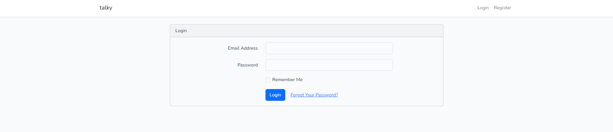

# PROJECT_SECURE_WEB_CHAT
This is a Project of Secure Web Coding Course at HUST

## Environment
* Ubuntu
* Nginx
* MySQL
* PHP:
    Modules: bcmath, calendar, Corectype, curl, date, dom, exif, FFI, fileinfo, filter, ftp, gd, gettext, hash, iconv, json, libxml, mbstring, mysqli, mysqlnd, openssl, pcntl, pcre, PDO, pdo_mysql, pdo_pgsql, pdo_sqlite, pgsql, Phar, posix, random, readline, Reflection, session, shmop, SimpleXML, sockets, sodium, SPL, sqlite3, standard, sysvmsg, sysvsem,  sysvshm, tokenizer, xml, xmlreader, xmlwriter, xsl, Zend OPcache, zip, zlib
* Redis
* Laravel:
    * laravel/ui
    * predis/redis
* JS Framework:
    * NodeJS
    * VueJS
    * Bootstrap
    * ...
* WebSockets: Socket.IO
* ................
* Setup environment: [LEMP Stack](https://www.digitalocean.com/community/tutorials/how-to-install-linux-nginx-mysql-php-lemp-stack-on-ubuntu-20-04), [Laravel Framework](https://laravel.com/docs/11.x/deployment)

## Architectures:
### Webserver
* Nginx                           

* Laravel request lifecycle

* Application Flow

## Implementation:
* Authentication:
    * Login page

    * Register page

    * Reset password page

    * Dashboard page

Feel free to contribute to our project!

